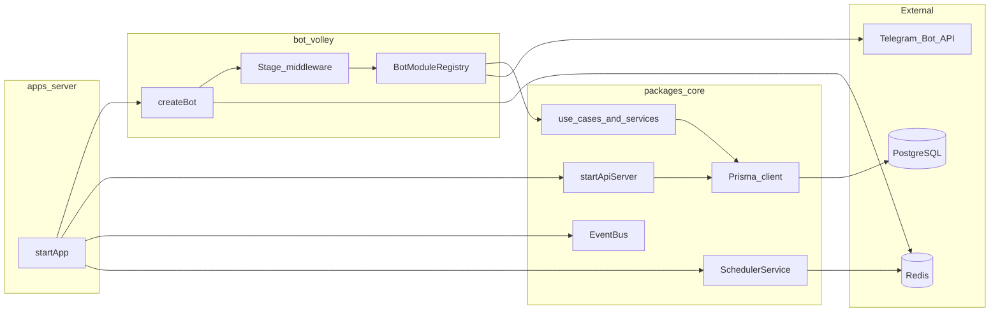

# Архитектура реализации

**Назначение:** описание того, *как* система устроена в репозитории и в runtime: монорепозиторий, процесс запуска, слои, данные, Telegram и HTTP. Детальная карта **модулей бота** (регистрация хендлеров, примеры кода) — в [modules.md](modules.md). Модель БД — в [data-model.md](data-model.md). HTTP API — в [api-reference.md](api-reference.md). Сессии и сцены Telegraf — в [session-management.md](session-management.md). Продуктовый scope — в [../business/product-and-capabilities.md](../business/product-and-capabilities.md).

---

## Монорепозиторий

Код не лежит в одном корневом `src/` приложения; домен и бот разнесены по пакетам.

| Путь | Роль |
|------|------|
| [apps/server/index.ts](../../apps/server/index.ts) | Точка входа процесса: `validateConfig`, Redis, `createBot`, EventBus, Scheduler, health, Fastify API, `bot.launch`, graceful shutdown |
| [packages/core/src](../../packages/core/src) | Домен (`domain/`), use cases (`application/`), Prisma (`infrastructure/prisma`, `prisma/schema` в [packages/core/prisma](../../packages/core/prisma)), API (`api/`), общие сервисы (`shared/`: логирование, event bus, scheduler, конфиг) |
| [packages/bot-volley/src](../../packages/bot-volley/src) | Telegraf-бот: `create-bot.ts`, модули (`bot/modules/*`), хендлеры, клавиатуры |
| [packages/bot-volley/src/bot/registration/](../../packages/bot-volley/src/bot/registration/) | Мультиспорт-онбординг: `onboarding-flow-controller`, `sports-picker-controller`, `volleyball-wizard-controller`, константы (`onboarding-callbacks`, `onboarding-text`) |
| [packages/bot-racket/src](../../packages/bot-racket/src) | Сцены и мастер профиля тенниса (`profile-setup/*`, `racket-scenes.ts`) |

Сборка: корневой [tsconfig.json](../../tsconfig.json) включает `apps/server`, `packages/core`, `packages/bot-volley`, `packages/bot-racket`.

---

## Запуск процесса (runtime)

1. **Redis:** клиент поднимается в `apps/server`, передаётся в `createBot({ sessionRedis })` для хранения сессий Telegraf (и отдельно используется BullMQ в scheduler).
2. **Бот:** `createBot` подключает `session`, затем **`Scenes.Stage`** со сценами из `getRacketScenes()` ([packages/bot-racket/src/racket-scenes.ts](../../packages/bot-racket/src/racket-scenes.ts)), затем регистрирует модули.
3. **HTTP:** `startApiServer` — Fastify, health, CORS по конфигу; не заменяет Telegram как основной UI.
4. **События и фон:** `registerEventHandlers`, `SchedulerService.initializeWorkers` — очереди BullMQ, обработчики доменных событий.

---

## Слои (логические)

| Слой | Где в репозитории | Ответственность |
|------|-------------------|-----------------|
| Presentation | `packages/bot-volley`, `packages/bot-racket` | Команды, callback, сцены, клавиатуры; тонкий слой без бизнес-правил |
| Application | `packages/core/src/application` | Use cases (`joinGame`, `createGame`, …), координация |
| Domain | `packages/core/src/domain` | Сущности, инварианты, доменные сервисы и ошибки |
| Infrastructure | `packages/core/src/infrastructure`, Prisma | Репозитории, БД, health |

Импорты между пакетами сейчас идут по относительным путям из исходников (например бот → `core/src/...`), собранный артефакт — единый `dist/` с корня.

---

## Telegram: модули и сцены

- **Модули** (`RegistrationModule`, `GameManagementModule`, …) регистрируют `bot.command`, `bot.action`, `bot.hears` после middleware сцены.
- **Сцена тенниса:** `WizardScene` с id **`tennis-profile`** (`TENNIS_SCENE_ID` в [tennis-callbacks.ts](../../packages/bot-racket/src/profile-setup/tennis-callbacks.ts)). Код: [profile-setup-scene.ts](../../packages/bot-racket/src/profile-setup/profile-setup-scene.ts). Шаги — `profile-setup-step-factory.ts` и `profile-setup/steps/`; тексты/callback — `tennis-text.ts`, `tennis-callbacks.ts`; сохранение — [profile-setup-persist.ts](../../packages/bot-racket/src/profile-setup/profile-setup-persist.ts). После сохранения — мост `profile-complete-bridge` и продолжение очереди в [onboarding-flow-controller.ts](../../packages/bot-volley/src/bot/registration/onboarding-flow-controller.ts).
- **Онбординг волейбола в боте:** фасад [onboarding-handlers.ts](../../packages/bot-volley/src/bot/registration/onboarding-handlers.ts) делегирует в `VolleyballWizardController` и `SportsPickerController`; состояние сессии — [onboarding-session.ts](../../packages/bot-volley/src/bot/registration/onboarding-session.ts), драфт волейбола — [volleyball-onboarding-state.ts](../../packages/bot-volley/src/bot/registration/volleyball-onboarding-state.ts).
- **Важно (Telegraf):** middleware шага wizard получает `(ctx, next)`. Если апдейт не обработан (например обычное текстовое сообщение), нужно вызывать **`next()`**, иначе цепочка обрывается и команды ниже по стеку не выполняются. В сцене после обработки `callback_query` выполняется `return` без `next()` — это намеренно (апдейт поглощён).

---

## Данные и интеграции

- **PostgreSQL:** единственная БД приложения; схема в [packages/core/prisma/schema.prisma](../../packages/core/prisma/schema.prisma).
- **Prisma Client:** генерируется из этой схемы (`npm run prisma:generate`).
- **Redis:** сессии бота; очереди планировщика (BullMQ).

---

## Тесты и скрипты

Сверяйтесь с корневым [package.json](../../package.json): `npm run test`, `npm run test:unit`, `npm run test:integration`, `npm run test:e2e`, `npm run test:ci`, `npm run prisma:migrate`, `npm run prisma:deploy`, `npm run lint`, `npm run build`, `npm run dev`.

---

## Связанные документы

- [overview.md](overview.md) — краткий обзор и исторические диаграммы слоёв (часть путей может указывать сюда как на каноничный каркас).
- [modules.md](modules.md) — детализация модулей бота.
- [session-management.md](session-management.md) — сессии и сцены.

**Последнее обновление:** 2026-05-15
