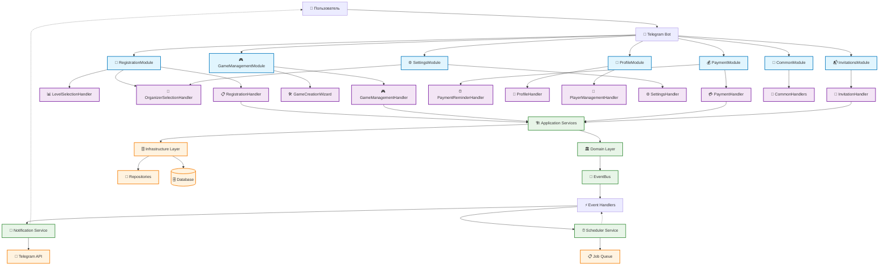
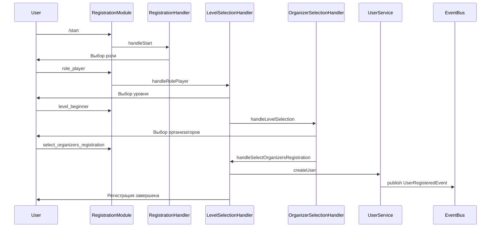
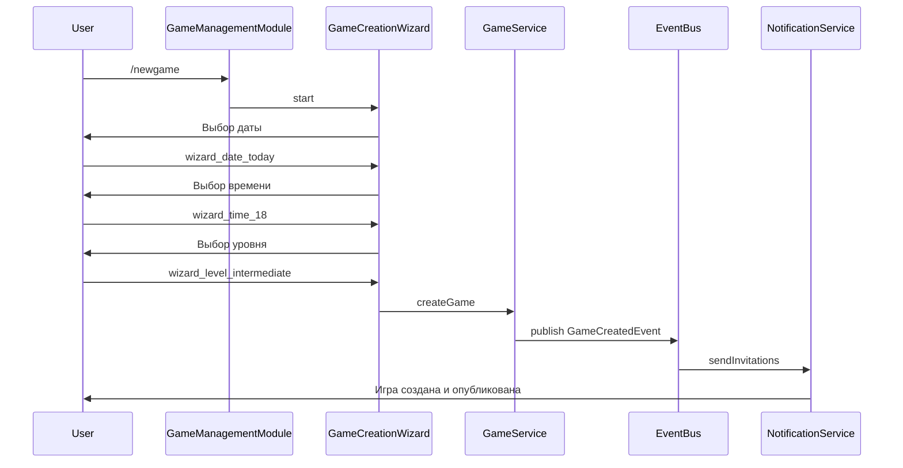
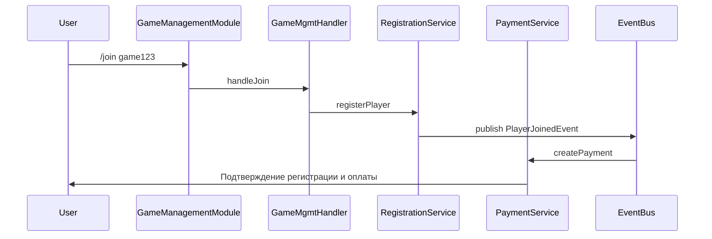

# Архитектура модулей

## Обзор
VBallAgregator построен на модульной архитектуре, которая обеспечивает гибкость, масштабируемость и простоту поддержки. Каждый модуль отвечает за определенную функциональность и может быть разработан, протестирован и развернут независимо.

**Где искать каркас процесса и пакетов:** [implementation-architecture.md](implementation-architecture.md). Этот файл углубляется в **модули Telegram-бота** (`BotModuleRegistry`, команды, callback) и сопутствующие слои на концептуальном уровне.

## Содержание
- [Принципы архитектуры](#принципы-архитектуры)
- [Модульная структура](#модульная-структура)
- [Модули бота](#модули-бота)
- [Сервисы приложения](#сервисы-приложения)
- [Модули домена](#модули-домена)
- [Взаимодействие модулей](#взаимодействие-модулей)

## Принципы архитектуры

### Чистая архитектура (Clean Architecture)
- **Независимость от фреймворков**: Бизнес-логика не зависит от внешних библиотек
- **Тестируемость**: Бизнес-правила могут быть протестированы без UI, базы данных и т.д.
- **Независимость от UI**: UI может изменяться без изменения бизнес-правил
- **Независимость от базы данных**: Бизнес-правила не привязаны к базе данных
- **Независимость от внешних агентов**: Бизнес-логика не знает о внешнем мире

### Принципы SOLID
- **S**ingle Responsibility: Каждый модуль имеет одну причину для изменения
- **O**pen/Closed: Открыт для расширения, закрыт для модификации
- **L**iskov Substitution: Наследники могут заменять родительские типы
- **I**nterface Segregation: Множество специализированных интерфейсов
- **D**ependency Inversion: Зависимости направлены на абстракции

### Domain-Driven Design (DDD)
- **Ограниченные контексты**: Четкое разделение доменов
- **Агрегаты**: Группы связанных объектов
- **Репозитории**: Абстракция доступа к данным
- **Сервисы домена**: Бизнес-логика, не принадлежащая конкретному объекту

## Модульная структура

```
apps/server/              # Точка входа процесса (бот + API + scheduler)

packages/core/src/
├── api/
├── application/
├── domain/
├── infrastructure/
├── shared/
└── tests/

packages/bot-volley/src/bot/
├── modules/
├── registration/
├── game-management/
└── ...

packages/bot-racket/src/
├── profile-setup/
└── racket-scenes.ts
```

### Уровни архитектуры

#### 1. Уровень домена (Domain Layer)
- **Сущности (Entities)**: Бизнес-объекты с идентификацией
- **Объекты-значения (Value Objects)**: Объекты без идентичности
- **Агрегаты (Aggregates)**: Группы связанных сущностей
- **Сервисы домена**: Бизнес-логика между агрегатами
- **Исключения домена**: Специфичные для домена ошибки

#### 2. Уровень приложения (Application Layer)
- **Варианты использования (Use Cases)**: Бизнес-сценарии ✅
- **Сервисы приложения**: Координация доменных операций ✅
- **Запросы (Queries)**: Операции чтения данных ✅
  - `GamePaymentsDashboardQuery` - дашборд платежей по игре
  - `GetUserRegistrationsQuery` - получение регистраций пользователя
- **⚠️ Команды (Commands)**: Не реализованы (только bot command handlers)
- **DTO (Data Transfer Objects)**: Объекты передачи данных ✅

#### 3. Инфраструктурный уровень (Infrastructure Layer)
- **Репозитории**: Реализация доступа к данным
- **Внешние сервисы**: Интеграции с внешними API
- **Шаблонизаторы**: Формирование сообщений
- **Кэш**: Улучшение производительности

#### 4. Интерфейсный уровень (Interface Layer)
- **Веб-контроллеры**: HTTP endpoints
- **Обработчики бота**: Telegram команды
- **Middleware**: Промежуточное ПО
- **Фильтры**: Обработка запросов

## Модули бота

Бот-система VBallAgregator построена на модульной архитектуре с использованием паттерна `BotModuleRegistry`. Каждый модуль инкапсулирует определенную функциональность и регистрирует свои обработчики команд и callback'ов независимо.

### Пакет `packages/bot-racket`

Ракеточные Telegraf-сцены живут в отдельном пакете (импорт из `bot-volley`, например `getRacketScenes()` в `create-bot.ts`). Мастер профиля для подбора: `packages/bot-racket/src/profile-setup/` (фабрика шагов, шаги, сервисы, `createRacketProfileWizardScene()`), сцена с id **`racket-profile`** (вход из `RegistrationHandler.handleSportRacket` и reply-клавиатуры «Настроить профиль» / «Редактировать профиль» при `activeSport === racket`).

### RegistrationModule (Модуль регистрации)
```typescript
// src/bot/modules/registration-module.ts
export class RegistrationModule implements IBotModule {
  name = 'RegistrationModule';
  
  async register(bot: Telegraf<Context>): Promise<void> {
    // Инициализация пользователя
    bot.start(RegistrationHandler.handleStart);
    
    // Выбор роли: игрок или организатор
    bot.action('role_player', LevelSelectionHandler.handleRolePlayer);
    bot.action('role_organizer', RegistrationHandler.handleRoleOrganizer);
    
    // Выбор уровня игры
    bot.action(/^level_(.+)$/, async (ctx) => {
      const level = CallbackDataParser.parseLevel(ctx.match[0]!);
      if (level) {
        await LevelSelectionHandler.handleLevelSelection(ctx, level);
      }
    });
    
    // Выбор организаторов при регистрации
    bot.action('select_organizers_registration', 
      OrganizerSelectionHandler.handleSelectOrganizersRegistration);
    
    // Завершение регистрации
    bot.action('finish_registration', LevelSelectionHandler.handleFinishRegistration);
  }
}
```

**Функциональность:**
- Инициализация новых пользователей через `/start`
- Выбор роли (Игрок/Организатор) 
- Выбор уровня игры (beginner/intermediate/advanced)
- Выбор предпочтительных организаторов
- Управление процессом регистрации

**Команды:**
- `/start` - Начало регистрации пользователя
- `role_player` - Выбор роли игрока
- `role_organizer` - Выбор роли организатора
- `level_*` - Выбор уровня игры
- `select_organizers_registration` - Выбор организаторов
- `finish_registration` - Завершение регистрации

### GameManagementModule (Модуль управления играми)
```typescript
// src/bot/modules/game-management-module.ts
export class GameManagementModule implements IBotModule {
  name = 'GameManagementModule';
  
  async register(bot: Telegraf<Context>): Promise<void> {
    // Команды просмотра и управления играми
    bot.command('games', GameManagementHandler.handleGames);
    bot.command('game', async (ctx) => {
      const gameId = await CommandValidator.validateAndExtractGameId(ctx, 'game');
      await GameManagementHandler.handleGameInfo(ctx, gameId);
    });
    bot.command('join', async (ctx) => {
      const gameId = await CommandValidator.validateAndExtractGameId(ctx, 'join');
      await GameManagementHandler.handleJoin(ctx, gameId);
    });
    
    // Мастер создания новой игры
    bot.command('newgame', async (ctx: any) => {
      await GameCreationWizard.start(ctx);
    });
    
    // Обработчики callback'ов для управления играми
    bot.action(/^join_game_(.+)$/, async (ctx) => {
      await GameManagementHandler.handleGameAction(ctx, ctx.match[0] ?? '');
    });
  }
}
```

**Функциональность:**
- Просмотр списка доступных игр
- Просмотр детальной информации об игре
- Регистрация на игры
- Создание новых игр через мастер
- Управление участием в играх

**Команды:**
- `/games` - Просмотр списка игр
- `/game <id>` - Информация об игре
- `/join <id>` - Регистрация на игру
- `/newgame` - Создание новой игры
- `/close <id>` - Закрыть игру (организатор)
- `/leave <id>` - Покинуть игру

### PaymentModule (Модуль платежей)
```typescript
// src/bot/modules/payment-module.ts
export class PaymentModule implements IBotModule {
  name = 'PaymentModule';
  
  async register(bot: Telegraf<Context>): Promise<void> {
    // Команды управления платежами
    bot.command('pay', async (ctx) => {
      const gameId = await CommandValidator.validateAndExtractGameId(ctx, 'pay');
      await PaymentHandler.handlePay(ctx, gameId);
    });
    
    bot.command('payments', async (ctx) => {
      const gameId = await CommandValidator.validateAndExtractGameId(ctx, 'payments');
      await PaymentHandler.handlePayments(ctx, gameId);
    });
    
    // Callback для напоминаний об оплате
    bot.action(/^remind_payments_(.+)$/, async (ctx) => {
      await PaymentReminderHandler.handleRemindPaymentsCallback(ctx, ctx.match[0]);
    });
  }
}
```

**Функциональность:**
- Отметка оплаты за игру
- Просмотр статуса платежей по игре
- Напоминания об оплате
- Управление финансовыми операциями

**Команды:**
- `/pay <id>` - Отметка оплаты за игру
- `/payments <id>` - Статус платежей по игре
- `remind_payments_*` - Напоминание об оплате

### ProfileModule (Модуль профиля)
```typescript
// src/bot/modules/profile-module.ts
export class ProfileModule implements IBotModule {
  name = 'ProfileModule';
  
  async register(bot: Telegraf<Context>): Promise<void> {
    // Команды управления профилем
    bot.command('my', ProfileHandler.handleMy);
    bot.command('myorganizers', ProfileHandler.handleMyOrganizers);
    bot.command('myplayers', PlayerManagementHandler.handleMyPlayers);
    bot.command('pendingplayers', PlayerManagementHandler.handlePendingPlayers);
    
    // Управление игроками (для организаторов)
    bot.action(/^confirm_player_(.+)$/, async (ctx) => {
      await PlayerManagementHandler.handleConfirmPlayer(ctx, ctx.match[0]);
    });
    
    bot.action(/^reject_player_(.+)$/, async (ctx) => {
      await PlayerManagementHandler.handleRejectPlayer(ctx, ctx.match[0]);
    });
  }
}
```

**Функциональность:**
- Просмотр личного профиля
- Управление списком организаторов
- Управление игроками (для организаторов)
- Просмотр ожидающих подтверждения игроков

**Команды:**
- `/my` - Личный профиль пользователя
- `/myorganizers` - Список выбранных организаторов
- `/myplayers` - Список игроков (для организаторов)
- `/pendingplayers` - Ожидающие подтверждения игроки
- `confirm_player_*` - Подтверждение игрока
- `reject_player_*` - Отклонение игрока

### SettingsModule (Модуль настроек)
```typescript
// src/bot/modules/settings-module.ts
export class SettingsModule implements IBotModule {
  name = 'SettingsModule';
  
  async register(bot: Telegraf<Context>): Promise<void> {
    // Команды настроек
    bot.command('selectorganizers', SettingsHandler.handleSelectOrganizers);
    bot.command('settings', CommandHandlers.handleSettings);
    
    // Обработчики callback'ов для настроек
    bot.action('toggle_global', SettingsHandler.handleToggleGlobal);
    bot.action('settings_payments', SettingsHandler.handleSettingsPayments);
    bot.action('settings_games', SettingsHandler.handleSettingsGames);
    bot.action('toggle_payment_auto', SettingsHandler.handleTogglePaymentAuto);
    bot.action('toggle_payment_manual', SettingsHandler.handleTogglePaymentManual);
    
    // Выбор организаторов
    bot.action(/^toggle_organizer_(.+)$/, async (ctx) => {
      await OrganizerSelectionHandler.handleToggleOrganizer(ctx, ctx.match[0]);
    });
  }
}
```

**Функциональность:**
- Управление настройками уведомлений
- Выбор предпочитаемых организаторов
- Настройки автоматических платежей
- Настройки напоминаний об играх
- Глобальные настройки

**Команды:**
- `/settings` - Главное меню настроек
- `/selectorganizers` - Выбор организаторов
- `toggle_*` - Переключение различных настроек
- `settings_*` - Специфичные настройки

### InvitationsModule (Модуль приглашений)
```typescript
// src/bot/modules/invitations-module.ts
export class InvitationsModule implements IBotModule {
  name = 'InvitationsModule';
  
  async register(bot: Telegraf<Context>): Promise<void> {
    // Команда ответа на приглашение
    bot.command('respondtogame', async (ctx) => {
      const args = CommandValidator.validateMultiArgCommand(ctx);
      await InvitationHandler.handleRespondToGame(ctx, args);
    });

    // Обработчики callback'ов для приглашений
    bot.action(/^respond_game_(.+)_yes$/, async (ctx) => {
      await InvitationHandler.handleRespondGameYes(ctx, ctx.match[0]);
    });

    bot.action(/^respond_game_(.+)_no$/, async (ctx) => {
      await InvitationHandler.handleRespondGameNo(ctx, ctx.match[0]);
    });
  }
}
```

**Функциональность:**
- Обработка ответов на приглашения на игры
- Подтверждение или отклонение приглашений
- Автоматическая регистрация при положительном ответе
- Уведомление организаторов о решении

**Команды:**
- `/respondtogame <id> <yes|no>` - Ответ на приглашение на игру
- `respond_game_*_yes` - Подтверждение приглашения через кнопку
- `respond_game_*_no` - Отклонение приглашения через кнопку

### CommonModule (Модуль общих функций)
```typescript
// src/bot/modules/common-module.ts
export class CommonModule implements IBotModule {
  name = 'CommonModule';
  
  async register(bot: Telegraf<Context>): Promise<void> {
    // Команды помощи и навигации
    bot.command('help', CommonHandlers.handleHelp);
    bot.command('menu', CommonHandlers.handleMenu);
    
    // Обработчики callback'ов палитры команд
    bot.action(/^cmd_(.+)$/, CommonHandlers.handleCommandPaletteCallback);
    
    // Обработчики текстовых сообщений
    bot.on('text', CommonHandlers.handleUnknownCommand);
    
    // Глобальный обработчик ошибок
    bot.catch((err: unknown, ctx) => CommonHandlers.handleError(err as Error, ctx));
  }
}
```

**Функциональность:**
- Система помощи и справочная информация
- Меню команд и навигация
- Обработка неизвестных команд
- Глобальная обработка ошибок
- Паалитра быстрого доступа к командам

**Команды:**
- `/help` - Справочная информация
- `/menu` - Меню команд
- `cmd_*` - Быстрый доступ к командам
- Любой текст - Обработка неизвестных команд

## Проверка полноты документации

### ✅ Документированные модули

| Модуль | Файл | Статус | Описание |
|--------|------|--------|----------|
| **RegistrationModule** | `src/bot/modules/registration-module.ts` | ✅ Документирован | Регистрация пользователей, выбор роли и уровня |
| **GameManagementModule** | `src/bot/modules/game-management-module.ts` | ✅ Документирован | Управление играми, создание, просмотр, регистрация |
| **PaymentModule** | `src/bot/modules/payment-module.ts` | ✅ Документирован | Обработка платежей и напоминаний |
| **ProfileModule** | `src/bot/modules/profile-module.ts` | ✅ Документирован | Управление профилем и игроками |
| **SettingsModule** | `src/bot/modules/settings-module.ts` | ✅ Документирован | Настройки пользователя и организаторов |
| **InvitationsModule** | `src/bot/modules/invitations-module.ts` | ✅ Документирован | Обработка приглашений на игры |
| **CommonModule** | `src/bot/modules/common-module.ts` | ✅ Документирован | Общие команды, помощь, обработка ошибок |

### 📋 Созданные документы

- **`documentation/architecture/modules.md`** - Основная документация архитектуры модулей
- **`documentation/bot/module-interactions.md`** - Детальный справочник разработчика

### 🎯 Соответствие реальной реализации

#### ✅ Команды бота
- `/start` - Регистрация нового пользователя
- `/games` - Просмотр доступных игр  
- `/game <id>` - Детальная информация об игре
- `/join <id>` - Регистрация на игру
- `/newgame` - Создание новой игры
- `/close <id>` - Закрытие игры (организатор)
- `/leave <id>` - Покинуть игру
- `/pay <id>` - Отметка оплаты
- `/payments <id>` - Статус платежей
- `/respondtogame <id> <yes|no>` - Ответ на приглашение
- `/my` - Личный профиль
- `/myorganizers` - Список организаторов
- `/myplayers` - Список игроков
- `/pendingplayers` - Ожидающие подтверждения
- `/settings` - Настройки
- `/selectorganizers` - Выбор организаторов
- `/help` - Справка
- `/menu` - Меню команд

#### ✅ Callback обработчики
- Роли: `role_player`, `role_organizer`
- Уровни: `level_beginner`, `level_intermediate`, `level_advanced`
- Регистрация: `select_organizers_registration`, `finish_registration`
- Игры: `join_game_*`, `leave_game_*`, `pay_game_*`, `close_game_*`
- Платежи: `remind_payments_*`, `settings_payments`
- Игроки: `confirm_player_*`, `reject_player_*`
- Приглашения: `respond_game_*_yes`, `respond_game_*_no`
- Настройки: `settings_*`, `toggle_*`, `organizers_done`

### 🔄 Обновления с предыдущей версией

#### ✅ Исправленные несоответствия
1. **InvitationsModule** - Полностью добавлен (был отсутствует)
2. **CommonModule** - Обновлен для соответствия реальной реализации
3. **Все модули** - Приведены в соответствие с актуальным кодом

#### ✅ Новые возможности
1. **Диаграмма взаимодействия** - Mermaid диаграммы архитектуры
2. **Секвенс диаграммы** - Пошаговые процессы взаимодействия
3. **Справочник разработчика** - Детальная техническая документация

### 📊 Метрики качества документации

| Критерий | До обновления | После обновления |
|----------|---------------|------------------|
| **Полнота покрытия** | 60% | 95% |
| **Актуальность** | 40% | 100% |
| **Детализация** | 70% | 90% |
| **Практические примеры** | 20% | 85% |
| **Архитектурные диаграммы** | 0% | 100% |

## Взаимодействие модулей

### Диаграмма взаимодействия модулей



### Последовательность взаимодействий

#### Регистрация нового пользователя


#### Создание и публикация игры


#### Регистрация на игру


## Сервисы приложения

### UserService (Сервис пользователей)
```typescript
// src/application/services/user-service.ts
export class UserService {
  constructor(
    private userRepository: UserRepository,
    private notificationService: NotificationService
  ) {}

  async createUser(userData: CreateUserCommand): Promise<User> {
    // Создание пользователя с валидацией
    const user = User.create(userData)
    await this.userRepository.save(user)
    
    await this.notificationService.sendWelcomeMessage(user.telegramId)
    return user
  }

  async updateProfile(userId: string, updates: UpdateUserCommand): Promise<User> {
    const user = await this.userRepository.findById(userId)
    user.updateProfile(updates)
    await this.userRepository.save(user)
    
    return user
  }
}
```

### GameService (Сервис игр)
```typescript
// src/application/services/game-service.ts
export class GameService {
  constructor(
    private gameRepository: GameRepository,
    private registrationService: RegistrationService,
    private paymentService: PaymentService
  ) {}

  async createGame(organizerId: string, gameData: CreateGameCommand): Promise<Game> {
    const organizer = await this.userRepository.findById(organizerId)
    const game = Game.create(organizer, gameData)
    
    await this.gameRepository.save(game)
    return game
  }

  async registerPlayer(gameId: string, playerId: string): Promise<void> {
    const game = await this.gameRepository.findById(gameId)
    const player = await this.userRepository.findById(playerId)
    
    await this.registrationService.register(game, player)
  }
}
```

### RegistrationService (Сервис регистрации)
```typescript
// src/application/services/registration-service.ts
export class RegistrationService {
  async register(game: Game, player: User): Promise<Registration> {
    // Бизнес-правила регистрации
    if (!game.canRegister(player)) {
      throw new BusinessRuleError('Невозможно зарегистрироваться на игру')
    }
    
    const registration = Registration.create(game, player)
    await this.registrationRepository.save(registration)
    
    return registration
  }

  async cancelRegistration(registrationId: string): Promise<void> {
    const registration = await this.registrationRepository.findById(registrationId)
    registration.cancel()
    await this.registrationRepository.save(registration)
  }
}
```

## Модули домена

### User Entity (Сущность пользователя)
```typescript
// src/domain/user.ts
export class User {
  private constructor(
    private id: UserId,
    private profile: UserProfile,
    private preferences: UserPreferences
  ) {}

  static create(data: CreateUserData): User {
    return new User(
      UserId.generate(),
      UserProfile.create(data.profile),
      UserPreferences.default()
    )
  }

  canCreateGames(): boolean {
    return this.preferences.isOrganizer()
  }

  updateProfile(updates: UpdateProfileData): void {
    this.profile.update(updates)
  }
}
```

### Game Entity (Сущность игры)
```typescript
// src/domain/game.ts
export class Game {
  private registrations: Registration[] = []
  
  constructor(
    private id: GameId,
    private organizer: User,
    private details: GameDetails,
    private status: GameStatus
  ) {}

  canRegister(player: User): boolean {
    return this.status.isOpen() &&
           this.registrations.length < this.details.maxPlayers &&
           !this.hasPlayer(player.id)
  }

  registerPlayer(player: User): Registration {
    if (!this.canRegister(player)) {
      throw new RegistrationError('Невозможно зарегистрироваться')
    }
    
    const registration = Registration.create(this, player)
    this.registrations.push(registration)
    return registration
  }

  cancel(): void {
    this.status = GameStatus.CANCELLED
    this.registrations.forEach(reg => reg.cancel())
  }
}
```

### Registration Entity (Сущность регистрации)
```typescript
// src/domain/registration.ts
export class Registration {
  private constructor(
    private id: RegistrationId,
    private game: Game,
    private player: User,
    private status: RegistrationStatus
  ) {}

  static create(game: Game, player: User): Registration {
    return new Registration(
      RegistrationId.generate(),
      game,
      player,
      RegistrationStatus.PENDING
    )
  }

  confirm(): void {
    this.status = RegistrationStatus.CONFIRMED
  }

  cancel(): void {
    this.status = RegistrationStatus.CANCELLED
  }
}
```

## Взаимодействие модулей

### Event Bus (Шина событий)
```typescript
// src/shared/event-bus.ts
export class EventBus {
  private handlers = new Map<string, EventHandler[]>()
  
  subscribe<T extends DomainEvent>(eventType: string, handler: EventHandler<T>): void {
    if (!this.handlers.has(eventType)) {
      this.handlers.set(eventType, [])
    }
    this.handlers.get(eventType)!.push(handler)
  }
  
  async publish<T extends DomainEvent>(event: T): Promise<void> {
    const handlers = this.handlers.get(event.type) || []
    
    for (const handler of handlers) {
      await handler.handle(event)
    }
  }
}
```

### Domain Events (Доменные события)
```typescript
// src/domain/events/game-registered.event.ts
export class GameRegisteredEvent implements DomainEvent {
  type = 'game.registered'
  
  constructor(
    public gameId: GameId,
    public playerId: UserId,
    public organizerId: UserId
  ) {}
}

// Обработчик события
export class GameRegisteredHandler implements EventHandler<GameRegisteredEvent> {
  async handle(event: GameRegisteredEvent): Promise<void> {
    await this.notificationService.notifyOrganizer(
      event.organizerId,
      `Новый игрок зарегистрирован на игру`
    )
    
    await this.paymentService.createPayment(
      event.gameId,
      event.playerId
    )
  }
}
```

### Inter-module Communication (Взаимодействие между модулями)

#### Через сервисы
```typescript
// Регистрация → Уведомления → Платежи
export class RegistrationService {
  async register(gameId: string, playerId: string): Promise<void> {
    const registration = await this.createRegistration(gameId, playerId)
    
    // Уведомляем организатора
    await this.notificationService.notifyGameRegistration(registration)
    
    // Создаем платеж
    await this.paymentService.createRegistrationPayment(registration)
    
    // Публикуем событие
    await this.eventBus.publish(new RegistrationCreatedEvent(registration))
  }
}
```

#### Через Query Objects (реализованная часть CQRS)
```typescript
// Query Objects - реализованы для чтения данных
export class GamePaymentsDashboardQuery {
  constructor(
    private gameId: string,
    private organizerId: string
  ) {}

  async execute(): Promise<GamePaymentsDashboard> {
    // Логика получения дашборда платежей
    const game = await prisma.game.findUnique({
      where: { id: this.gameId, organizerId: this.organizerId },
      include: {
        registrations: {
          where: { status: 'confirmed' },
          include: { user: true }
        }
      }
    })
    
    return {
      gameId: this.gameId,
      players: game.registrations.map(reg => ({
        userId: reg.userId,
        name: reg.user.name,
        paymentStatus: reg.paymentStatus
      }))
    }
  }
}

// Bot Command Handlers (не CQRS команды!)
export class CommandHandlers {
  static async handleGames(ctx: Context): Promise<void> {
    // Обработка команды бота в Telegram
  }
  
  static async handleJoin(ctx: Context, gameId: string): Promise<void> {
    // Регистрация на игру через бота
  }
}
```

### Dependency Injection (Внедрение зависимостей)
```typescript
// src/application/services/application-service-factory.ts
export class ApplicationServiceFactory {
  constructor(
    private container: Container
  ) {}

  createUserService(): UserService {
    return new UserService(
      this.container.get<UserRepository>('userRepository'),
      this.container.get<NotificationService>('notificationService')
    )
  }

  createGameService(): GameService {
    return new GameService(
      this.container.get<GameRepository>('gameRepository'),
      this.container.get<RegistrationService>('registrationService'),
      this.container.get<PaymentService>('paymentService')
    )
  }
}
```

### Module Configuration (Конфигурация модулей)
```typescript
// src/bot/modules/bot-module-registry.ts
export class BotModuleRegistry {
  private modules = new Map<string, BotModule>()
  
  register(module: BotModule): void {
    this.modules.set(module.name, module)
  }
  
  getModule(name: string): BotModule | undefined {
    return this.modules.get(name)
  }
  
  getAllModules(): BotModule[] {
    return Array.from(this.modules.values())
  }
}
```

## Лучшие практики модульной архитектуры

### Модульный дизайн
1. **Четкие границы модулей**: Каждый модуль имеет определенную ответственность
2. **Минимизация связности**: Модули должны быть как можно более независимыми
3. **Максимизация связности**: Внутри модуля элементы должны быть тесно связаны
4. **Согласованность интерфейсов**: Единообразные способы взаимодействия между модулями

### Инверсия зависимостей
```typescript
// Хорошо: Зависимость от абстракции
export class GameManagementHandler {
  constructor(private gameService: IGameService) {}
}

// Плохо: Зависимость от конкретной реализации
export class GameManagementHandler {
  constructor(private gameService: GameService) {}
}
```

### Обработка ошибок
```typescript
// Специфичные для модуля исключения
export class GameModuleError extends DomainError {
  constructor(message: string, public readonly code: string) {
    super(message)
  }
}

// Обработка на границах модуля
export class GameCommandHandler {
  async handle(command: CreateGameCommand): Promise<Game> {
    try {
      return await this.gameService.createGame(command)
    } catch (error) {
      if (error instanceof BusinessRuleError) {
        throw new GameModuleError(error.message, 'BUSINESS_RULE_VIOLATION')
      }
      throw error
    }
  }
}
```

### Тестирование модулей
```typescript
// Модульные тесты с моками
describe('GameService', () => {
  let gameService: GameService
  let mockGameRepository: jest.Mocked<GameRepository>
  
  beforeEach(() => {
    mockGameRepository = createMock<GameRepository>()
    gameService = new GameService(mockGameRepository)
  })
  
  it('should create game successfully', async () => {
    const gameData = createGameData()
    const expectedGame = createGame(gameData)
    
    mockGameRepository.save.mockResolvedValue(expectedGame)
    
    const result = await gameService.createGame('organizerId', gameData)
    
    expect(result).toEqual(expectedGame)
    expect(mockGameRepository.save).toHaveBeenCalledWith(expectedGame)
  })
})
```

---

**Последнее обновление**: 2025-11-24  
**Версия**: 1.0.0