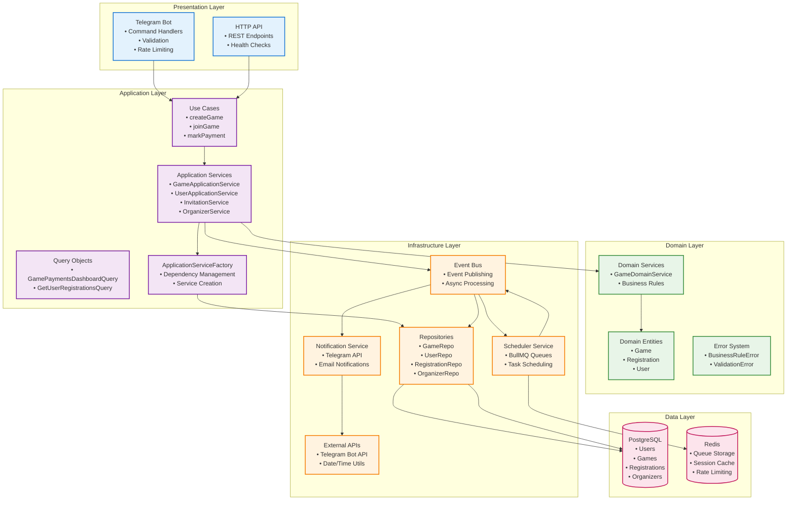

## **🏗️ Архитектура системы**

### **Монолитная структура с модульной организацией**
Проект реализован как **модульный монолит** с четким разделением на слои DDD (Domain-Driven Design):

- **Domain Layer**: Бизнес-логика, доменные сущности (Game, Registration), правила валидации, доменные сервисы
- **Application Layer**: Use cases, Application Services, Query Objects
- **Infrastructure Layer**: Репозитории, внешние API, event handlers
- **Shared Layer**: Утилиты, конфигурация, кросс-компонентная логика

### **Основные компоненты**

#### **Frontend (Telegram Bot)**
- Интерфейс взаимодействия с пользователями через Telegram API
- Обработка команд и предоставление информации
- Rate limiting для защиты от спама
- Валидация входных данных

#### **Backend (Node.js + TypeScript)**
- **Domain Layer** ([`src/domain/`](../../src/domain/)):
  - **Aggregate Roots**:
    - `Game` - управление жизненным циклом игры (статусы: open, closed, finished, canceled)
    - `Registration` - управление регистрацией участников (статусы: confirmed, waitlist, canceled)
  - **Value Objects**: Статусы, ошибки, перечисления
  - **Domain Services**:
    - `GameDomainService` - бизнес-правила для игр
    - Валидация бизнес-правил (capacity, payment window, game status)
  - **Error System**:
    - `BusinessRuleError` - нарушение бизнес-правил
    - `ValidationError` - ошибки валидации
    - `SystemError` - системные ошибки

- **Application Layer**:
  - Use cases для основных операций
  - Application Services для координации
  - Query Objects для сложных запросов

- **Infrastructure Layer**:
  - Prisma ORM для работы с PostgreSQL
  - Event Bus для асинхронной обработки
  - Scheduler для отложенных задач
  - Notification Service для отправки сообщений

#### **Database & Infrastructure**
- **PostgreSQL**: Основная БД с индексами для производительности
- **Redis**: Кэширование и управление очередями (BullMQ)
- **Docker**: Контейнеризация для развертывания

### **Масштабируемость**
- **Текущая реализация**: Модульный монолит, подходящий для MVP
- **Будущая эволюция**: Возможен переход на микросервисы при росте нагрузки
- **Горизонтальное масштабирование**: Через репликацию БД и балансировку нагрузки
- **Вертикальное масштабирование**: Увеличение ресурсов сервера

### **Архитектурные паттерны**
- **DDD (Domain-Driven Design)**: Разделение на домены и bounded contexts ✅
- **Query Objects**: Реализованы для чтения данных ✅
- **Repository Pattern**: Полная реализация с базовым классом и интерфейсами ✅
- **Event-Driven Architecture**: Асинхронная обработка через Event Bus ✅
- **Application Services**: Координация между слоями ✅
- **⚠️ Command Pattern**: Команды не реализованы (только bot command handlers)

### **Диаграмма взаимодействия компонентов**

### **Event Flow (поток событий)**

#### **Создание игры:**
1. **Bot** → **Application Layer** (`createGame` use case)
2. **Application Service** → **Domain Service** (валидация бизнес-правил)
3. **Repository** → **Database** (сохранение игры)
4. **Event Publisher** → **Event Bus** (`GameCreated` event)
5. **Event Handler** → **Scheduler** (планирование напоминаний)

#### **Регистрация на игру:**
1. **Bot** → **Application Layer** (`joinGame` use case)
2. **Application Service** → **Domain Service** (проверка capacity, дедлайнов)
3. **Repository** → **Database** (создание регистрации)
4. **Event Bus** → **Notification Service** (`PlayerJoined` event)
5. **Notification Service** → **Telegram API** (уведомление организатора)

#### **Напоминания:**
1. **Scheduler** (BullMQ) → **Event Bus** (`GameReminder24h` event)
2. **Event Handler** → **Repository** (получение участников)
3. **Notification Service** → **Telegram API** (массовые уведомления)
4. **Metrics** (обновление счетчиков отправленных уведомлений)

#### **Оплата:**
1. **Bot** → **Application Layer** (`markPayment` use case)
2. **Domain Service** (проверка окна оплаты)
3. **Repository** → **Database** (обновление статуса)
4. **Event Bus** → **Notification Service** (`PaymentMarked` event)
5. **Notification Service** → **Telegram API** (уведомление организатора)

