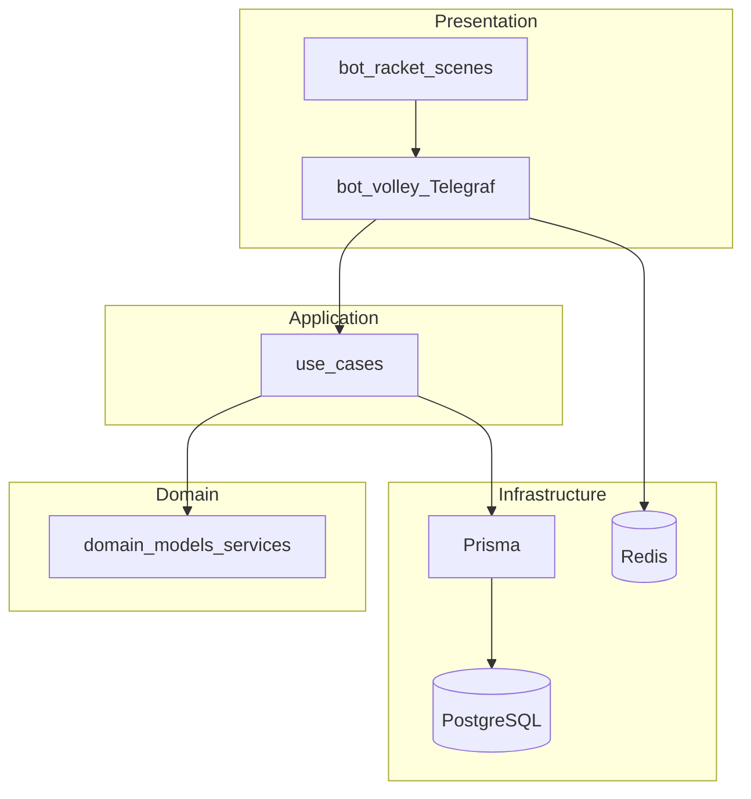

# Обзор архитектуры

Этот файл даёт **краткую** картину. Каноничное описание реализации по пакетам, процессу запуска и Telegram — в **[implementation-architecture.md](implementation-architecture.md)**. Продуктовые возможности и виды спорта — в **[../business/product-and-capabilities.md](../business/product-and-capabilities.md)**.

---

## Модель: модульный монолит

Приложение — один процесс Node.js ([apps/server/index.ts](../../apps/server/index.ts)), внутри которого:

- **Telegram-бот** (`packages/bot-volley`, сцены из `packages/bot-racket`) вызывает use cases и репозитории из **`packages/core`**.
- **HTTP API** (Fastify в `packages/core/src/api`) даёт health и служебные endpoints.
- **PostgreSQL** + **Prisma**; **Redis** — сессии Telegraf и очереди BullMQ (планировщик, обработка событий).

Слои DDD по смыслу: **presentation** (бот) → **application** (use cases) → **domain** → **infrastructure** (Prisma, внешние API). Исходники домена и приложения: [packages/core/src/domain](../../packages/core/src/domain), [packages/core/src/application](../../packages/core/src/application).

---

## Диаграмма потоков (упрощённо)

---

## Потоки событий (логика)

Примеры цепочек (детали в implementation-architecture и в коде use cases):

1. **Создание игры:** бот → `createGame` → домен/репозиторий → при необходимости событие → планировщик/уведомления.
2. **Запись на игру:** бот → `joinGame` → проверка вместимости и окон → регистрация → уведомления.
3. **Оплата:** бот → `markPayment` → обновление статуса → события/уведомления.

---

## Дальнейшее чтение

| Тема | Документ |
|------|----------|
| Пакеты, запуск, сцены, `next()` в wizard | [implementation-architecture.md](implementation-architecture.md) |
| Модули бота, примеры регистрации | [modules.md](modules.md) |
| Таблицы и поля БД | [data-model.md](data-model.md) |
| REST / health | [api-reference.md](api-reference.md) |
| Сессии Telegraf | [session-management.md](session-management.md) |

**Последнее обновление:** 2026-05-14
