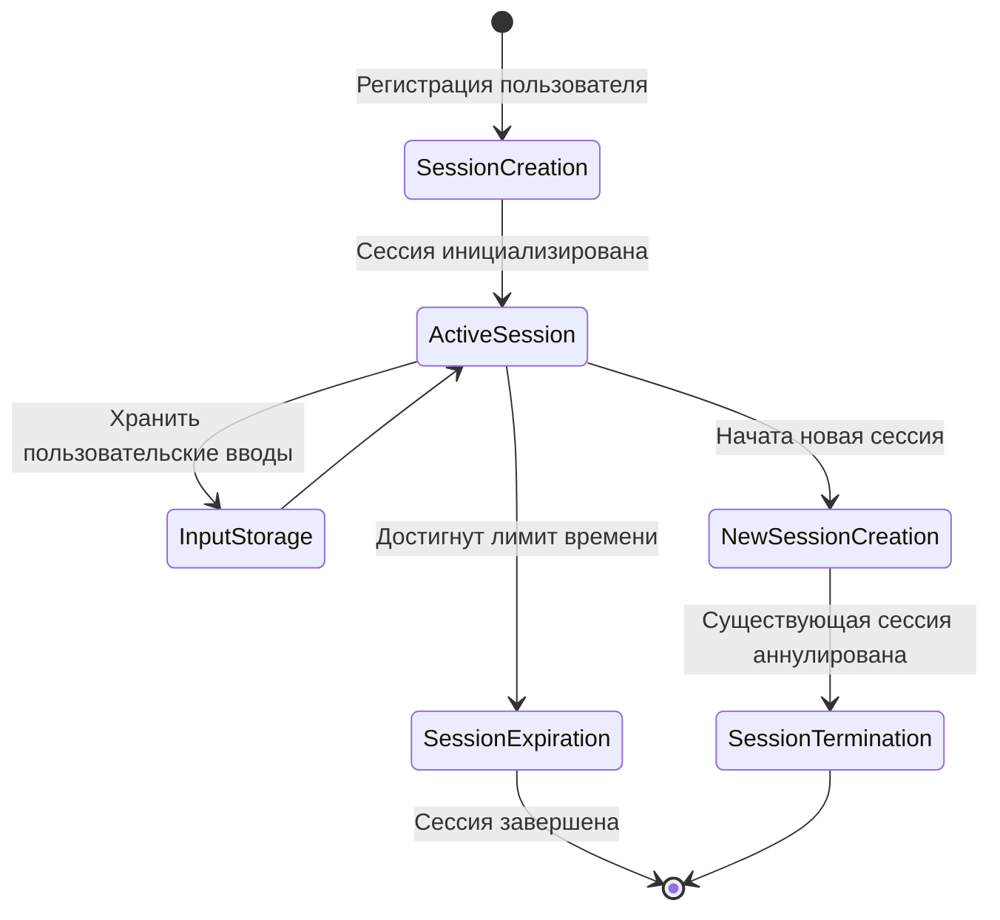

# Архитектура управления пользовательскими сессиями

## Обзор
Система управления пользовательскими сессиями предоставляет надежный механизм для отслеживания и управления взаимодействиями пользователей в процессе регистрации и других критически важных рабочих процессов.

## Ключевые концепции
- **Singleton Session**: Гарантирует только одну активную сессию на пользователя
- **Ограниченные по времени**: Сессии имеют настраиваемое время истечения
- **Сохранение ввода**: Хранит все пользовательские вводы во время сессии
- **Автоматическое завершение**: Создание новой сессии аннулирует существующие сессии

## Компоненты архитектуры
1. **Интерфейс UserSession**
   - `id`: Уникальный идентификатор сессии
   - `userId`: Связанный идентификатор пользователя
   - `createdAt`: Временная метка создания сессии
   - `expiresAt`: Временная метка истечения сессии
   - `data`: Гибкое хранилище для пользовательских вводов
   - `isActive`: Текущий статус сессии

2. **Методы управления сессиями**
   - `create()`: Инициализировать новую сессию
   - `terminate()`: Завершить текущую сессию
   - `extendSession()`: Продлить время жизни сессии
   - `storeInput(key, value)`: Сохранить пользовательский ввод
   - `getInput(key)`: Получить сохраненный ввод
   - `isExpired()`: Проверить валидность сессии

## Рабочий процесс

## Соображения по реализации
- Использовать хранилище в памяти с возможностью постоянного хранения
- Реализовать потокобезопасный паттерн singleton
- Настроить таймаут сессии через переменные окружения
- Добавить комплексное логирование для событий жизненного цикла сессии

## Рекомендации по безопасности
- Шифровать конфиденциальные данные сессии
- Реализовать безопасную генерацию идентификаторов сессии
- Добавить ограничение частоты запросов для предотвращения злоупотребления сессиями