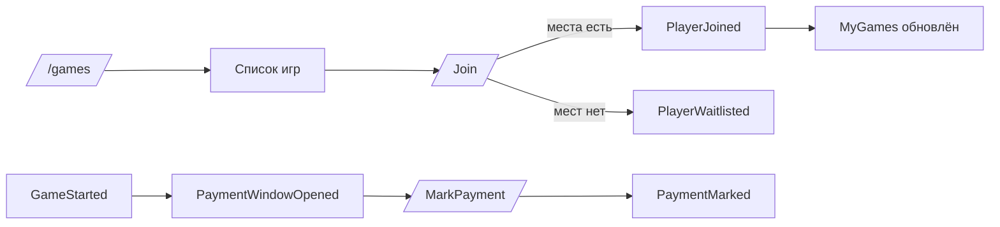
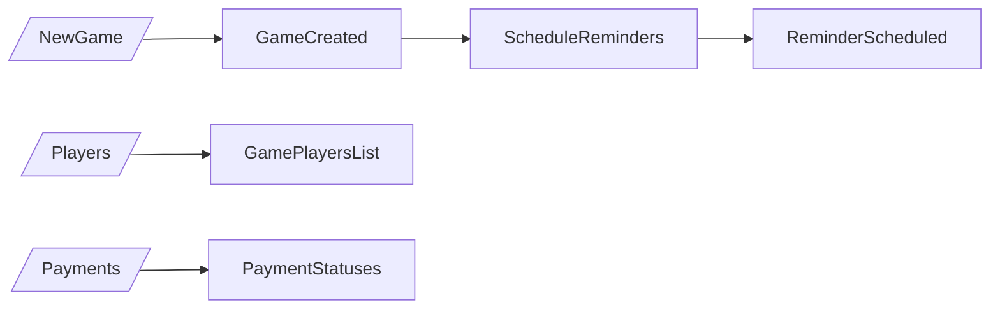
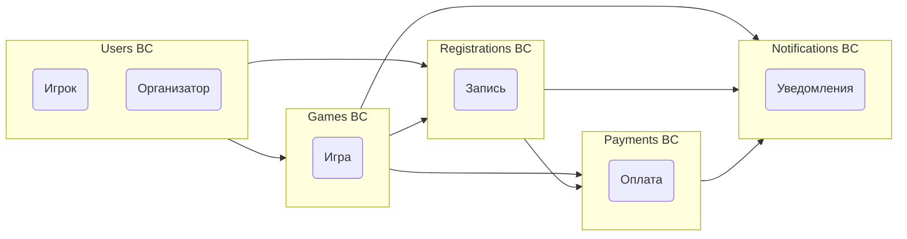

# **Архитектура волейбольного агрегатора: доменная модель и системные артефакты**

## 🏗️ **Bounded Contexts (Ограниченные контексты)**

| Контекст | Назначение | Основные сущности |
|-----------|-------------|-------------------|
| **Users** | Регистрация, роли, профили | `User`, `Organizer` |
| **Games** | Создание и управление играми | `Game`, `Venue` |
| **Registrations** | Запись, отмена, лист ожидания | `Registration` |
| **Payments** | Оплаты игр (ручная отметка) | `Payment` (в составе Registration) |
| **Notifications** | Уведомления и напоминания | `Notification` |

## 🟧 **Domain Events (Доменные события)**

### Основные события системы:
1. `GameCreated` — игра создана организатором
2. `PlayerJoined` — игрок записался (подтверждён)
3. `PlayerWaitlisted` — игрок добавлен в лист ожидания
4. `RegistrationCanceled` — игрок отменил участие
5. `WaitlistedPromoted` — игрок переведён из листа ожидания
6. `GameClosed` — набор закрыт
7. `GameStarted` — старт игры
8. `PaymentWindowOpened` — разрешена отметка оплаты
9. `PaymentAttemptRejectedEarly` — попытка оплаты до старта отклонена
10. `PaymentMarked` — игрок отметил оплату
11. `ReminderScheduled` — напоминание запланировано
12. `ReminderSent` — напоминание отправлено

## 🟦 **Commands (Команды)**

### Для игроков:
- `/start` — регистрация и выбор роли
- `/games` — просмотр открытых игр
- `/join <id>` — записаться на игру
- `/leave <id>` — отменить запись
- `/my` — список моих игр
- `MarkPayment` — отметить оплату (после начала игры)

### Для организаторов:
- `/newgame` — создать игру
- `/players <id>` — просмотр состава
- `/close <id>` — закрыть набор
- `/payments <id>` — сводка оплат
- `/message <id>` — рассылка участникам
- `/report <id>` — итоговая статистика

## 🟪 **Policies (Бизнес-правила)**

| Правило | Триггер | Действие |
|---------|----------|----------|
| `OnGameCreated → ScheduleReminder` | `GameCreated` | Планирование напоминаний за 24ч/2ч |
| `OnRegistrationCanceled → PromoteWaitlisted` | `RegistrationCanceled` | Продвижение первого из листа ожидания |
| `OnGameStarted → OpenPaymentWindow` | `GameStarted` | Разрешение отметки оплаты |
| `OnCapacityReached → BlockNewJoins` | Достигнут лимит | Блокировка новых confirmed-записей |

## 🟩 **Aggregates и инварианты**

### Game Aggregate
```javascript
class Game {
  invariants: [
    "capacity > confirmedCount",
    "status ∈ {open, closed, finished, canceled}",
    "startsAt > now() для открытых игр"
  ]
}
```

### Registration Aggregate
```javascript
class Registration {
  invariants: [
    "unique(gameId, userId)",
    "valid status transitions: waitlisted → confirmed → canceled"
  ]
}
```

## 🟨 **Read Models (Проекции данных)**

| Проекция | Назначение | Источники событий |
|----------|-------------|-------------------|
| `UpcomingGamesList` | Список ближайших игр | `GameCreated`, `GameClosed` |
| `MyGames` | Игры пользователя | `PlayerJoined`, `RegistrationCanceled` |
| `GamePlayersList` | Участники игры | `PlayerJoined`, `PaymentMarked` |
| `OrganizerPaymentsDashboard` | Статусы оплат | `PaymentMarked`, `PaymentReminderSent` |

## 🔄 **Пользовательские сценарии**

### Игрок: поиск → запись → оплата


### Организатор: создание → управление


## 🗺️ **Context Map (Карта контекстов)**



## ⚠️ **Hotspots (Проблемные зоны)**

### Технические риски:
- **Гонки данных** при одновременных join/leave
- **Надёжность доставки** Telegram-сообщений
- **Идемпотентность** обработки оплат
- **Синхронизация времени** между сервисами

### Бизнес-риски:
- **Двойные записи** от одного пользователя
- **Неоплаты** после участия в игре
- **Отмены в последний момент**

## 📊 **Event → DB Mapping**

| Событие | Изменение БД | Read Model Update |
|---------|--------------|-------------------|
| `GameCreated` | `games.insert` | `UpcomingGamesList` |
| `PlayerJoined` | `registrations.upsert` | `MyGames`, `GamePlayersList` |
| `PaymentMarked` | `registrations.update` | `GamePlayersList`, `MyGames` |
| `RegistrationCanceled` | `registrations.update` | `MyGames`, `GamePlayersList` |

## 🔧 **Ключевые бизнес-правила**

### Правило оплаты:
```javascript
// Оплата разрешена ТОЛЬКО после начала игры
function canMarkPayment(game, currentTime) {
  return currentTime >= game.startsAt && 
         game.status === 'open';
}
```

### Правило листа ожидания:
```javascript
// FIFO продвижение из листа ожидания
function promoteWaitlisted(gameId) {
  const nextInLine = getOldestWaitlisted(gameId);
  if (nextInLine) {
    return promoteToConfirmed(nextInLine);
  }
}
```

## 🎯 **Критерии готовности MVP**

- ✅ Полный цикл создания и записи на игру
- ✅ Напоминания T-24/T-2 отправляются адресно
- ✅ Окно оплаты открывается строго с `startsAt`
- ✅ Статусы оплат отображаются организатору
- ✅ Лист ожидания работает (FIFO продвижение)

---

**Архитектурные принципы:**
- Event-driven architecture
- Modular monolith с четкими границами контекстов
- CQRS для read models
- Background jobs для уведомлений
- Transaction boundaries через агрегаты